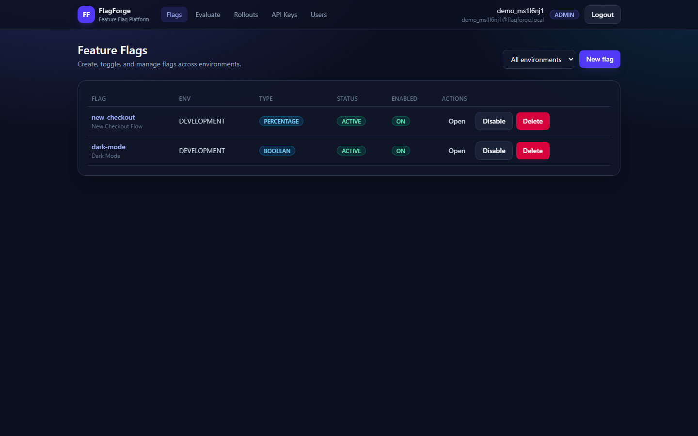
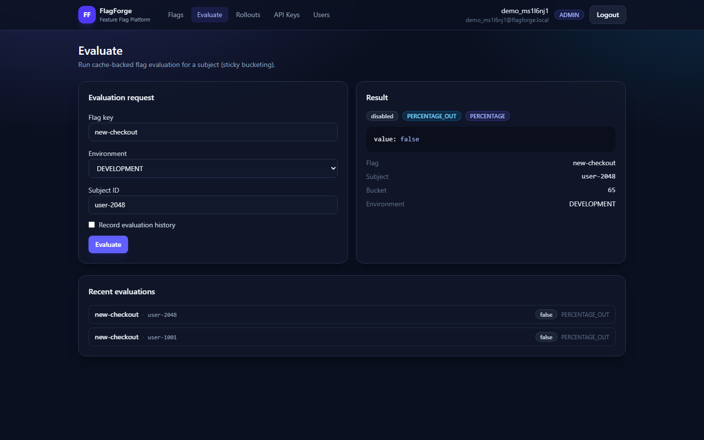
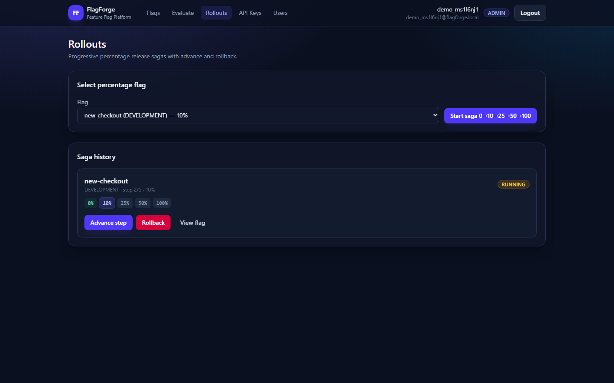

# FlagForge

**Open-source feature flag platform** — progressive rollouts, sticky percentage bucketing, SDK API keys, and a React dashboard.

Built with **Spring Boot 4 · Java 21 · CQRS · JWT** and **React · Redux Toolkit · Redux-Saga · Vite · Tailwind**.

[](#)
[](#)
[](#)
[](LICENSE)

### Why this project?

Shipping features behind a full deploy is slow and risky. Feature flags let you turn capabilities on for a slice of users, roll out gradually, or run variants—without rebuilding the app for every change. FlagForge is a hands-on implementation of that idea: sticky evaluation, progressive rollouts, a dashboard for operators, and an SDK-style evaluate API for clients. It was built to explore clean backend design (CQRS, sagas, dual auth) end to end, not only to sketch architecture on a whiteboard.

---

## Demo

Walkthrough of the live dashboard (register → flags → evaluate → rollouts → API keys → users).

<!-- GitHub renders this on the repo home page once the file is on the default branch -->
<video src="demo/out/flagforge-demo.webm" controls width="100%" poster="demo/screens/03-flags-list.png">
  Your browser does not support embedded video.
  <a href="demo/out/flagforge-demo.webm">Download the demo video (WebM)</a>
</video>

**Files in this repo:** [demo video](demo/out/flagforge-demo.webm) · [screenshots](demo/screens/)

https://github.com/user-attachments/assets/8d1bbff2-73af-448a-9b0d-80f890150223

| Flags list | Evaluate (sticky bucket) | Progressive rollout |
|:---:|:---:|:---:|
|  |  |  |
| Manage flags across environments | Subject evaluation with bucket & reason | Step-wise percentage sagas |

---

## Bookmarks (after you start the app)

Use these once FlagForge is running (defaults for **local mode 1 — H2**).

| What | URL | Notes |
|------|-----|--------|
| **Dashboard (UI)** | http://localhost:5173 | React app |
| **Register** | http://localhost:5173/register | First user becomes **ADMIN** |
| **Login** | http://localhost:5173/login | |
| **Flags** | http://localhost:5173/flags | |
| **Evaluate** | http://localhost:5173/evaluate | Sticky bucket demo |
| **Rollouts** | http://localhost:5173/rollouts | Percentage sagas |
| **API Keys** | http://localhost:5173/api-keys | EDITOR+ |
| **Users** | http://localhost:5173/users | ADMIN only |
| **Backend API** | http://localhost:8080 | |
| **Swagger UI** | http://localhost:8080/swagger-ui.html | Try APIs in browser |
| **OpenAPI JSON** | http://localhost:8080/v3/api-docs | |
| **Health** | http://localhost:8080/actuator/health | |
| **H2 console** | http://localhost:8080/h2-console | See credentials below |
| **SDK evaluate** | `POST` http://localhost:8080/api/v1/sdk/evaluate | Header `X-API-Key` |

### H2 console (local default DB)

| Field | Value |
|-------|--------|
| URL in browser | http://localhost:8080/h2-console |
| **JDBC URL** | `jdbc:h2:mem:flagforge` |
| **User** | `sa` |
| **Password** | _(leave empty)_ |

### Infra ports (when that service is running)

| Service | Host URL / port | Used in |
|---------|-----------------|--------|
| **Redis** | `localhost:6379` | Menu **2**, **3**, **4** |
| **Kafka** | `localhost:9092` | Menu **2**, **3**, **4** (host apps) |
| **Postgres** | `localhost:5432` · db/user/pass: `flagforge` | Menu **4** only |
| **Vite → API proxy** | Browser calls `/api/*` → `http://127.0.0.1:8080` | Frontend dev server |

Inside Docker Compose, services talk to each other as `postgres:5432`, `redis:6379`, `kafka:29092`, `backend:8080`.

---

## Features

- **Flag types:** boolean, percentage rollout, multivariate variants  
- **Sticky bucketing:** same `subjectId` always lands in the same 0–99 bucket per flag (`CRC32`)  
- **Progressive rollouts:** multi-step sagas with advance / rollback  
- **Dual auth:** JWT dashboard + SDK **API keys** (`X-API-Key`)  
- **CQRS + domain events** (log or Kafka)  
- **Eval cache:** in-memory or Redis  
- **One-click control center:** Windows / macOS / Linux launcher  

---

## Quick start

### Option A — Control center (recommended)

| OS | How |
|----|-----|
| **Windows** | Double-click **`FlagForge.bat`** |
| **macOS / Linux** | `chmod +x FlagForge.sh && ./FlagForge.sh` |

| Menu | Mode | Stack |
|------|------|--------|
| **1** | Local H2 | Host BE + FE · H2 · memory cache · log events |
| **2** | Local + Redis/Kafka | Host BE + FE · H2 · Docker Redis + Kafka |
| **3** | Docker + H2 | All containers · H2 inside backend |
| **4** | Full Docker | Postgres + Redis + Kafka + BE + FE |
| **5** | Stop app | Leave infra containers |
| **6** | Stop everything | Host processes + containers |
| **7** | Wipe Docker data | `compose down -v` (destructive) |

The mode you pick **sets the Spring profile / env** — the app does not auto-detect Redis/Kafka/Postgres.

**Prerequisites:** JDK 21 · Node 20+ · Docker Desktop (for modes 2–4).

### Option B — Manual (H2 only)

```bash
# Terminal 1 — API
cd backend
./gradlew bootRun          # Windows: .\gradlew.bat bootRun

# Terminal 2 — UI
cd frontend
npm install
npm run dev
```

Then open **http://localhost:5173/register**.

### First minutes

1. Register → you are **ADMIN** (first account on a fresh DB).  
2. Create a **PERCENTAGE** flag (e.g. `new-checkout`).  
3. Start a **rollout** (0 → 10 → 25 → 50 → 100).  
4. **Evaluate** different `subjectId`s — note `bucket` and `enabled`.  
5. Create an **API key** and call the SDK endpoint (Swagger or curl).  

---

## Architecture (short)

```
flagforge/
├── FlagForge.bat / .ps1 / .sh   # control center
├── docker-compose.yml
├── deploy/                      # Docker backend env files only
├── demo/                        # demo video + screenshots
├── backend/                     # Spring Boot API
│   └── com.flagforge
│       ├── domain/              # entities, evaluation engine, ports
│       ├── application/         # CQRS + rollout sagas
│       ├── infrastructure/      # JPA, cache, Kafka/log, security
│       └── presentation/        # REST + DTOs
└── frontend/                    # React dashboard
    └── src/{api,features,pages,store}
```

| Concern | Default | Optional profile |
|---------|---------|------------------|
| Database | H2 in-memory | Postgres (`docker`) |
| Flag cache | Memory | Redis (`redis-kafka` / `docker`) |
| Domain events | Logging | Kafka (`redis-kafka` / `docker`) |

### Key design decisions

- **CQRS** — Flag and rollout **writes** go through command handlers (validation, audit, cache refresh, events). **Reads** (list/get flags, evaluate orchestration) stay on the query side so the hot evaluate path is not tangled with admin mutations.
- **Sticky bucketing (`CRC32`)** — `bucket = CRC32(flagKey + ":" + subjectId) % 100` gives a stable 0–99 slot per subject. Percentage flags use `bucket < percentage`; multivariate maps the same bucket onto weighted variants. No session store—any instance returns the same answer for the same subject.
- **Dual auth** — Operators use **JWT** (roles: VIEWER / EDITOR / ADMIN). Client apps use **API keys** (`X-API-Key`) on `/api/v1/sdk/**`, optionally scoped to one environment, so production evaluate traffic does not share dashboard sessions.
- **Progressive rollout sagas** — Percentage flags can step through ladders (e.g. 0→10→25→50→100) with start / advance / rollback. One **RUNNING** saga per flag; rollback disables the flag and restores the first step—controlled canaries without ad-hoc percentage edits only.
- **Cache: memory vs Redis** — Evaluate loads a flag **snapshot** from cache first (DB on miss). **Memory** is zero-deps for local mode; **Redis** shares cache across instances when you scale out.
- **Events: logging vs Kafka** — After successful writes, domain events are published. **Logging** is enough for local demos; **Kafka** is the same port with a real bus for audit or downstream consumers. Evaluate itself does not depend on Kafka.
- **Trade-offs** — H2 data is ephemeral; targeting is subject-sticky (no full attribute rule engine yet); multivariate shares a 0–99 bucket space (few arms are realistic); launcher modes set profiles explicitly—the app does not auto-detect Redis/Kafka/Postgres.

---

## API overview

| Area | Base path | Auth |
|------|-----------|------|
| Auth | `/api/v1/auth` | Public register/login; `/me` needs JWT |
| Flags | `/api/v1/flags` | JWT |
| Evaluate | `/api/v1/evaluate` | JWT (dashboard) |
| Rollouts | `/api/v1/rollouts` | JWT |
| API Keys | `/api/v1/api-keys` | JWT EDITOR/ADMIN |
| Users | `/api/v1/users` | JWT ADMIN |
| **SDK Evaluate** | `/api/v1/sdk/evaluate` | **`X-API-Key`** |

### Evaluation fields (SDK + dashboard)

| Field | Use it for |
|-------|------------|
| **`enabled`** | On/off gate (in rollout / feature on) |
| **`value`** | Payload string (`true`/`false`, variant name, …) |
| **`bucket`** | Sticky 0–99 for that subject |
| **`reason`** | Why (`PERCENTAGE_IN`, `FLAG_DISABLED`, …) |

**Percentage rule:** `bucket < percentage` ⇒ in rollout.  
Bucket = `CRC32(flagKey + ":" + subjectId) % 100`.

### SDK example

```http
POST /api/v1/sdk/evaluate
X-API-Key: ffk_xxxxxxxx_yyyyyyyy...
Content-Type: application/json

{
  "flagKey": "dark-mode",
  "environment": "DEVELOPMENT",
  "subjectId": "user-or-device-id"
}
```

Create keys via the dashboard (**API Keys**) or `POST /api/v1/api-keys` with a JWT. The **raw key is shown once**.

### Roles

| Role | Can |
|------|-----|
| VIEWER | Read flags, evaluate, view rollouts |
| EDITOR | Mutate flags/rollouts, manage API keys |
| ADMIN | All of the above + delete flags + manage users |

---

## Docker Compose (without the menu)

```bash
docker compose --profile redis-kafka up -d          # Redis + Kafka only
docker compose --profile docker-h2 up -d --build    # Full app, H2 in backend
docker compose --profile docker-full up -d --build  # Postgres + everything
```

Env files: `deploy/backend-h2.env`, `deploy/backend-full.env` (container backend only).

---

## Tests

```bash
# Backend
cd backend && ./gradlew test

# Frontend unit
cd frontend && npm test

# Frontend e2e (mocks API — no backend required)
cd frontend && npx playwright install chromium && npm run test:e2e
```

---

## Configuration knobs

| Property | Default | Notes |
|----------|---------|-------|
| `flagforge.cache.type` | `memory` | `redis` in redis-kafka / docker |
| `flagforge.messaging.type` | `logging` | `kafka` in redis-kafka / docker |
| `flagforge.security.jwt.secret` | dev secret in repo | Change if you deploy for real |
| `spring.profiles.active` | _(none)_ | `redis-kafka` or `docker` |

---

## Contributing / feedback

This is a personal open-source project. Issues and PRs are welcome:

1. Fork → branch → PR  
2. Keep changes focused; run backend + frontend tests when you touch those areas  
3. Prefer short, precise comments/Javadocs over noise  

## License

[MIT](LICENSE) — free to use, modify, and learn from.

---

## Roadmap ideas

- Flyway/Liquibase for Postgres  
- Attribute-based targeting beyond subject bucketing  
- Rate limits / multi-tenant orgs  

---

**Made for learning and demos.** Start with menu **1**, open the [bookmarks](#bookmarks-after-you-start-the-app), and explore.
